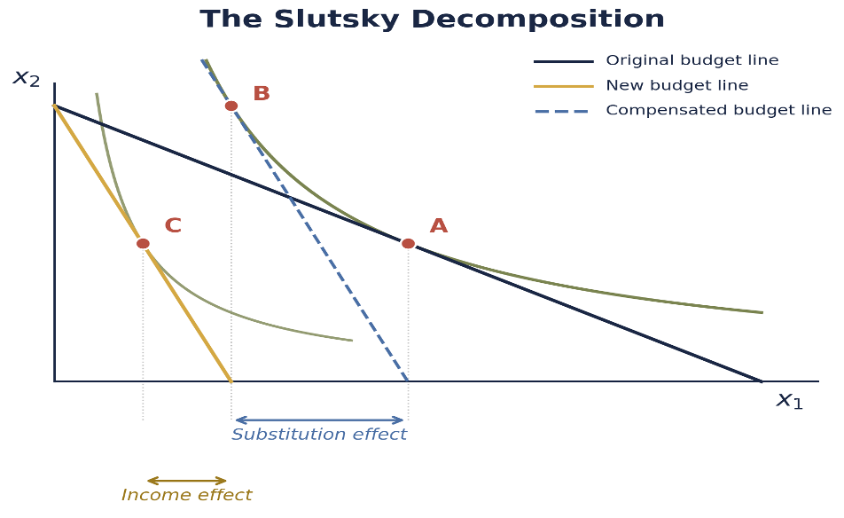

Hello everyone, I am so happy to share my first blog post!

Today, I want to discuss the **Slutsky decomposition**, because I think it is one of those ideas that looks much harder when we first see the equations than it really is.

Suppose the price of coffee goes up. The first reaction is simple: coffee is more expensive, so I buy less of it. But that answer combines two different forces. First, coffee is now more expensive relative to other goods, so I have a reason to substitute away from it. Second, even if my income does not change, the same income buys less than before, so my real purchasing power falls.

The difficult part is that these two effects happen at the same time. We only observe the move from the original choice to the final choice. We do not directly see how much came from substitution and how much came from lower purchasing power. Economists therefore introduce a hypothetical compensation step. We imagine giving the consumer just enough income to stay at the original utility level after the price change. This is not meant to describe what literally happens; it is a thought experiment that isolates the response to the new relative prices. Once that compensation is removed, the remaining change is the income effect.

The basic idea is

$$
\text{Total Effect}
=
\text{Substitution Effect}
+
\text{Income Effect}.
$$

The example below makes this separation concrete and then connects it to the general Slutsky equation.

## A Numerical Example

Suppose a consumer chooses between coffee, $x$, and all other goods, $y$, with preferences

$$
U(x,y)=xy^2.
$$

The consumer has income $m$ and faces prices $p_x$ and $p_y$. The budget constraint is

$$
p_xx+p_yy=m.
$$

The consumer solves

$$
\max_{x,y} xy^2
$$

subject to

$$
p_xx+p_yy=m.
$$

The Lagrangian is

$$
\mathcal{L}
=
xy^2+\lambda(m-p_xx-p_yy).
$$

The first-order conditions are

$$
\frac{\partial\mathcal{L}}{\partial x}
=
y^2-\lambda p_x
=
0
$$

and

$$
\frac{\partial\mathcal{L}}{\partial y}
=
2xy-\lambda p_y
=
0.
$$

Dividing the two conditions gives

$$
\frac{y}{2x}
=
\frac{p_x}{p_y},
$$

so

$$
y
=
\frac{2p_x}{p_y}x.
$$

Substituting into the budget constraint gives

$$
3p_xx=m.
$$

Therefore, the Marshallian demands are

$$
x(p_x,m)
=
\frac{m}{3p_x}
$$

and

$$
y(p_y,m)
=
\frac{2m}{3p_y}.
$$

To keep the arithmetic clean, I use **normalized prices** rather than literal café prices. Suppose

$$
m=120,
\qquad
p_x=1,
\qquad
p_y=1.
$$

The original bundle is

$$
x_0=40
$$

and

$$
y_0=80.
$$

The original utility level is

$$
u_0
=
40(80)^2
=
256000.
$$

Now suppose the normalized price of coffee rises from

$$
p_x=1
$$

to

$$
p_x'=8.
$$

With income unchanged,

$$
x_1
=
\frac{120}{3(8)}
=
5.
$$

So the total effect is

$$
TE
=
x_1-x_0
=
5-40
=
-35.
$$

We know demand fell by 35 units, but we still have not separated why.

## Step 1: The Substitution Effect

To isolate the substitution effect, hold the consumer at the original utility level and ask how the consumer would respond to the new relative prices. This gives Hicksian, or compensated, demand. In the standard Slutsky equation, this Hicksian demand measures the substitution effect.

We solve

$$
\min_{x,y}
\;
p_x'x+p_yy
$$

subject to

$$
xy^2=u_0.
$$

The Lagrangian is

$$
\mathcal{L}
=
p_x'x+p_yy
+
\mu(u_0-xy^2).
$$

The first-order conditions are

$$
p_x'
=
\mu y^2
$$

and

$$
p_y
=
2\mu xy.
$$

Dividing them gives

$$
\frac{p_x'}{p_y}
=
\frac{y}{2x},
$$

so

$$
y
=
\frac{2p_x'}{p_y}x.
$$

Substituting into the utility constraint,

$$
x
\left(
\frac{2p_x'}{p_y}x
\right)^2
=
u_0,
$$

which gives

$$
4
\frac{(p_x')^2}{p_y^2}
x^3
=
u_0.
$$

Therefore, the Hicksian demand for coffee is

$$
h_x(p_x',p_y,u_0)
=
\left(
\frac{u_0p_y^2}
{4(p_x')^2}
\right)^{1/3}.
$$

Using

$$
u_0=256000,
\qquad
p_x'=8,
\qquad
p_y=1,
$$

we obtain

$$
x^H=10.
$$

The substitution effect is therefore

$$
SE
=
x^H-x_0
=
10-40
=
-30.
$$

Even with utility held constant, coffee is relatively more expensive, so the consumer substitutes away from it.

## Step 2: The Income Effect

Next, remove the hypothetical compensation and return the consumer to the original income.

Coffee demand falls from 10 to 5, so

$$
IE
=
x_1-x^H
=
5-10
=
-5.
$$

Nominal income has not changed, but the higher coffee price has reduced real purchasing power.

Therefore,

$$
\text{Total Effect}
=
\text{Substitution Effect}
+
\text{Income Effect},
$$

and

$$
-35
=
-30+(-5).
$$

The example can be summarized as

$$
\boxed{
40
\rightarrow
10
\rightarrow
5
}
$$

where the first movement is the substitution effect and the second is the income effect.

## Visualizing the Decomposition

{fig-align="center" width="85%"}

In the figure, $x_1$ represents coffee and $x_2$ represents all other goods. Point A is the original choice. Point B is the compensated choice, so A to B is the **substitution effect**. Removing the compensation moves the consumer from B to C, which is the **income effect**. Together, they give the total movement from A to C.

## From the Example to the Slutsky Equation

The same idea can be written more generally using the duality relationship

$$
x_i(p,e(p,\bar{u}))
=
h_i(p,\bar{u}).
$$

Differentiate both sides with respect to $p_j$:

$$
\frac{\partial x_i}{\partial p_j}
+
\frac{\partial x_i}{\partial m}
\frac{\partial e}{\partial p_j}
=
\frac{\partial h_i}{\partial p_j}.
$$

By Shephard's Lemma,

$$
\frac{\partial e}{\partial p_j}
=
h_j(p,\bar{u}).
$$

At the corresponding income level,

$$
h_j(p,\bar{u})
=
x_j(p,m).
$$

Therefore,

$$
\frac{\partial x_i}{\partial p_j}
+
x_j
\frac{\partial x_i}{\partial m}
=
\frac{\partial h_i}{\partial p_j}.
$$

Rearranging gives the Slutsky equation:

$$
\boxed{
\frac{\partial x_i}{\partial p_j}
=
\frac{\partial h_i}{\partial p_j}
-
x_j
\frac{\partial x_i}{\partial m}
}
$$

The left side is the total price effect. The first term on the right is the compensated substitution effect, while the second captures the income effect.

## Interpreting the Decomposition

For an own-price change,

$$
\frac{\partial h_i}{\partial p_i}
\leq 0.
$$

So the substitution effect is always non-positive: holding utility constant, a consumer does not substitute toward a good simply because it became relatively more expensive.

The income effect depends on the type of good. For a **normal good**, it reinforces the substitution effect after a price increase. For an **inferior good**, it works in the opposite direction. In the rare case of a **Giffen good**, the income effect can be strong enough to outweigh the substitution effect.

## Takeaway

The main idea of the Slutsky decomposition is that a price change affects demand through two separate channels: **relative prices** and **real purchasing power**. In the numerical example, coffee demand falls from 40 to 5 units. Of that total decline, 30 units come from the substitution effect and 5 units come from the income effect. The compensated choice allows us to separate these two forces, even though the compensation itself is only hypothetical. More generally, the Slutsky equation shows how the total effect of a price change can be decomposed into substitution and income effects. This helps us understand not only **that** demand changes when prices change, but more importantly, **why** it changes.

## Data Source

No external data are used in the numerical example. All numerical values are hypothetical and are used only to illustrate the Slutsky decomposition. The Slutsky decomposition figure is from Dr. Lipsitz's *Class_03_EMP_and_Slutsky.pptx*, slide 17. The idea for this blog post was also inspired by what we recently discussed in Dr. Lipsitz's Applied Microeconomics class.