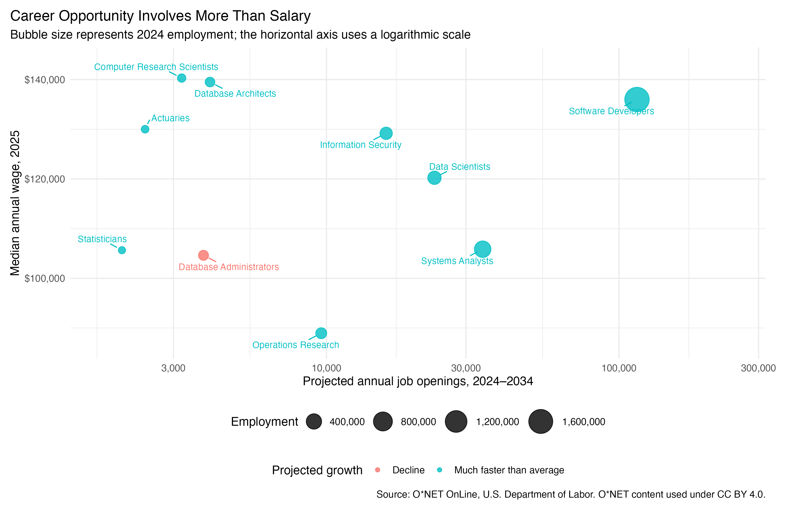
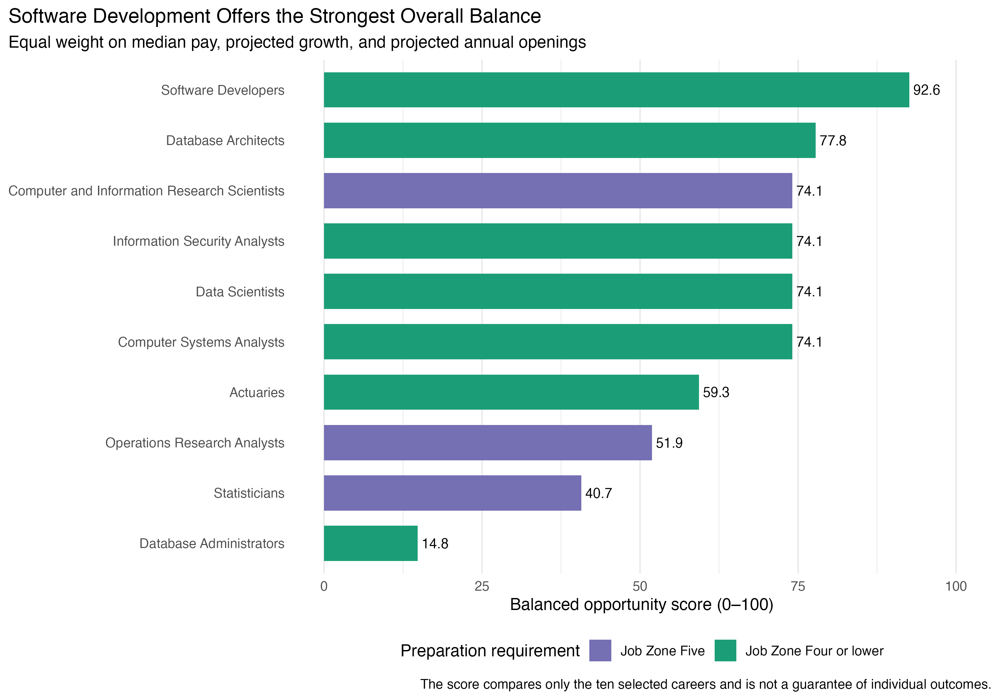

Hello everyone! For my second blog post, I wanted to use web scraping to answer a question that matters to many students: **which data or technology career offers the best combination of pay and opportunity?**

A high salary by itself does not necessarily make a career the best choice. Some high-paying occupations have few openings, while others require graduate education. Therefore, I compared median pay, projected growth, job openings, and preparation requirements across ten computer, data, and mathematical occupations. I also selected occupations that represent software development, information systems, cybersecurity, databases, and quantitative analysis.

## Collecting the Data Responsibly

I collected the data from [O\*NET OnLine](https://www.onetonline.org/), a career-information website sponsored by the U.S. Department of Labor. Each occupation page reports 2025 median wages, 2024 employment, projected growth and openings for 2024–2034, a Job Zone, and typical education information.

I used `rvest` to read ten public occupation pages. The basic scraping step looked like this:

```{r}
#| label: scrape-example
#| eval: false
#| echo: true

library(rvest)

page <- read_html(profile_url)

wage_section <- page |>
  html_element("#WagesEmployment")

labels <- wage_section |>
  html_elements("dl > dt") |>
  html_text2()

values <- wage_section |>
  html_elements("dl > dd") |>
  html_text2()
```

The scraper pauses for two seconds between requests and saves every HTML page locally. If I run it again, it reads the saved files instead of contacting the website. I did not access pages behind a login, CAPTCHA, paywall, or another restriction.

The complete scraping code, saved HTML, data, and replication instructions are available in my [GitHub repository](https://github.com/Changlin-DU/blogpost2_webscraping).

## From Web Pages to Comparable Numbers

The scraped values initially arrived as text. For example, an annual wage appeared inside a string containing both hourly and annual pay, and projected growth appeared as a phrase such as “Much faster than average (7% or higher).” I separated the wage fields, removed dollar signs and commas, converted openings into numbers, and ordered the growth categories from decline to much faster than average.

To summarize the tradeoffs, I created a balanced opportunity score:

$$
\text{Score}
=
100
\left(
\frac{
\text{wage percentile}
+
\text{growth index}
+
\text{openings percentile}
}{3}
\right).
$$

Wage and openings were converted to percentile rankings within the ten careers, while the growth categories were placed on a zero-to-one scale. The score is not meant to declare one career universally “best.” It is a simple way to compare three factors using the same scale. Because nine of the ten occupations were classified as “much faster than average,” most of the differences in the final ranking came from wages and job openings.

## Salary Tells Only Part of the Story

{#fig-career-tradeoff fig-alt="Scatter plot comparing median annual wages and projected annual openings for ten data and technology careers." width="100%"}

@fig-career-tradeoff shows why considering multiple measures matters. Computer and Information Research Scientists had the highest median annual wage at \$140,300, but only 3,200 projected annual openings and a Job Zone Five classification. O\*NET describes Job Zone Five occupations as requiring extensive preparation, often including graduate education.

Database Architects also offered high pay at \$139,500, but their 4,000 annual openings were small compared with broader occupations. Data Scientists combined a \$120,230 median wage with 23,400 openings. Computer Systems Analysts had a lower median wage of \$105,850 but 34,200 openings.

The clearest outlier was Software Developers. Their median annual wage was \$135,980, and their 115,200 projected annual openings were more than three times the number for any other career in the comparison.

## Turning the Results into a Decision

{#fig-career-ranking fig-alt="Horizontal bar chart ranking ten careers by their balanced opportunity score." width="100%"}

Software Developers ranked first with a balanced score of 92.6. They combined high pay, a much-faster-than-average growth category, the most openings, and a Job Zone Four classification. Database Architects ranked second, followed by Computer and Information Research Scientists.

For a student mainly interested in quantitative analysis rather than general software development, Data Scientists provide a more focused recommendation. They ranked fifth overall but offered a stronger balance of pay and openings than Statisticians or Operations Research Analysts. Strong programming skills are still valuable because data science increasingly overlaps with software development and database systems.

Database Administrators ranked last and were the only occupation with a declining outlook. This does not mean database knowledge is unimportant. Instead, students interested in databases may be better served by combining SQL and database skills with cloud computing, architecture, programming, or data analysis.

## Takeaway

My main takeaway is that students should not choose a career using salary alone. For the strongest overall combination of pay and demand, software development is the most practical recommendation in this comparison. For students committed to quantitative analysis, data science is a strong alternative. These results are national averages for ten selected careers, so interests, location, education costs, and working conditions should remain part of the final decision.

## Reference

*This post includes information from O\*NET OnLine by the U.S. Department of Labor, Employment and Training Administration. The information is used under the [CC BY 4.0 license](https://creativecommons.org/licenses/by/4.0/). I cleaned and analyzed the data for this project.*
