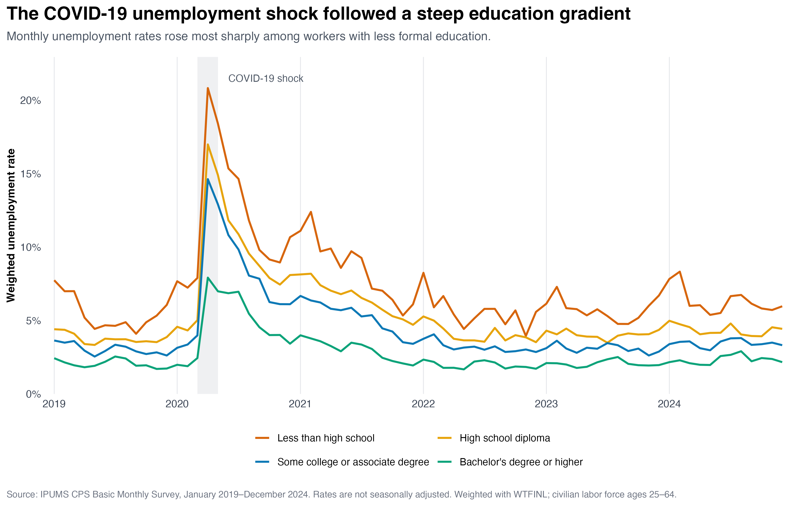
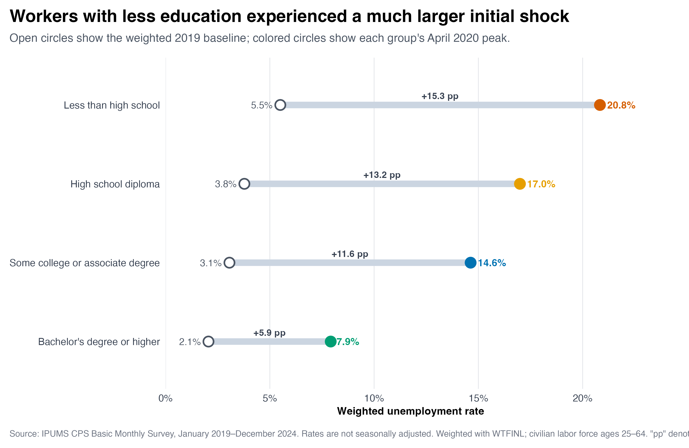
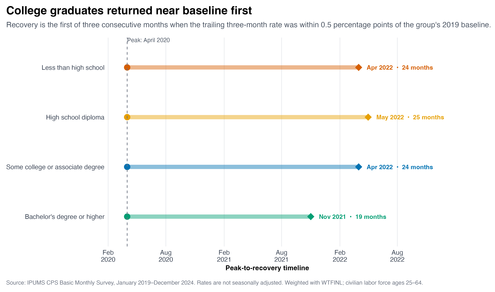

Hello everyone and welcome back! For my third blog post, I wanted to revisit a familiar economic event from a different angle. We know that unemployment increased dramatically during the first months of COVID-19, but the national unemployment rate only tells us what happened on average. It does not show which workers were hit hardest or which groups recovered first.

My question is: **how did unemployment recovery following the COVID-19 shock differ across educational attainment groups?**

## Building a Comparable Measure

I use IPUMS Current Population Survey (CPS) Basic Monthly microdata from January 2019 through December 2024. I focus on members of the civilian labor force ages 25–64 and divide them into four groups: less than high school, high school diploma, some college or an associate degree, and bachelor’s degree or higher.

Because the CPS is a sample, I use the Basic Monthly person weight, `WTFINL`, for every population estimate. For education group \(g\) in month \(t\), the weighted unemployment rate is

$$
u_{g,t}
=
\frac{
\sum_{i \in (g,t)}
w_i \mathbb{1}(\text{unemployed}_i)
}{
\sum_{i \in (g,t)} w_i
},
$$

where \(w_i\) is respondent \(i\)'s `WTFINL` weight. The numerator is the weighted number of unemployed workers, while the denominator is the weighted civilian labor force. In R, I calculate it as follows:

```{r}
#| label: weighted-rate-example
#| eval: false
#| echo: true

monthly_rates <- cps_labor_force |>
  group_by(date, education_group) |>
  summarise(
    weighted_labor_force = sum(weight),
    weighted_unemployed = sum(weight * unemployed),
    unemployment_rate =
      weighted_unemployed / weighted_labor_force,
    .groups = "drop"
  )
```

The complete extraction, cleaning, analysis, and visualization code is available in my [GitHub repository](https://github.com/Changlin-DU/CPS_Visualization_training).

## One Recession, Four Different Shocks

{#fig-unemployment-paths fig-alt="Line chart showing monthly weighted unemployment rates from 2019 through 2024 for four education groups. Unemployment rose most sharply for workers with less than a high school education and least sharply for workers with a bachelor's degree or higher." width="100%"}

@fig-unemployment-paths shows a clear education gradient even before the pandemic. In 2019, the weighted unemployment rate was 5.5% for workers with less than a high school education, compared with 2.1% for workers with a bachelor’s degree or higher.

All four groups reached their pandemic-period peak in April 2020. Unemployment reached 20.8% among workers with less than a high school education, 17.0% among high school graduates, 14.6% among workers with some college or an associate degree, and 7.9% among workers with at least a bachelor’s degree.

The rates declined after the initial shock, but the gaps remained visible. By 2024, the annual rates were 6.3%, 4.4%, 3.4%, and 2.3%, respectively. Each group’s rate was still slightly above its own 2019 baseline.

## Education and the Initial Shock

{#fig-peak-shock fig-alt="Dumbbell chart comparing the weighted 2019 unemployment baseline with the April 2020 unemployment peak for four education groups." width="100%"}

@fig-peak-shock makes the size of the initial shock easier to compare. Relative to the 2019 baseline, unemployment increased by 15.3 percentage points for workers without a high school diploma. The increase was 13.2 points for high school graduates and 11.6 points for workers with some college or an associate degree. For workers with a bachelor’s degree or higher, it was much smaller at 5.9 points.

One possible reason is that workers with more education were more likely to hold jobs that could be performed remotely or were less concentrated in face-to-face service industries. This descriptive analysis cannot establish that mechanism, but it clearly shows where the largest unemployment burden was concentrated.

## Who Returned Near Baseline First?

To compare recovery timing, I calculate a trailing three-month average:

$$
\bar{u}^{(3)}_{g,t}
=
\frac{
u_{g,t}+u_{g,t-1}+u_{g,t-2}
}{3}.
$$

I classify a month as near the pre-pandemic baseline when

$$
\bar{u}^{(3)}_{g,t}
\leq
u_{g,2019}+0.005.
$$

The value \(0.005\) represents 0.5 percentage points. Sustained recovery is the first post-peak month satisfying this condition when it also remains satisfied for the following two months. Requiring three consecutive months prevents one unusually low estimate from being treated as a completed recovery.

{#fig-recovery-timeline fig-alt="Timeline showing that workers with a bachelor's degree or higher returned near their 2019 unemployment baseline in November 2021, earlier than the other education groups." width="100%"}

As @fig-recovery-timeline shows, workers with a bachelor’s degree or higher reached this benchmark in November 2021, 19 months after the peak. The other groups reached it between April and May 2022. The exact dates depend on my recovery definition, but applying the same rule to every group provides a consistent comparison.

## Takeaway

My main takeaway is that the COVID-19 labor-market shock was unequal in both magnitude and duration. Workers with less formal education experienced much larger increases in unemployment, while workers with a bachelor’s degree or higher experienced the smallest shock and returned near their pre-pandemic baseline several months earlier.

Looking only at the national unemployment rate would miss this distributional story. The labor market recovered from the initial collapse, but different education groups traveled very different paths back.

These estimates are descriptive and are not seasonally adjusted. The Bureau of Labor Statistics also reported that some people absent from work during the early pandemic were recorded as employed when they may have been on temporary layoff. The recorded rates may therefore understate part of the initial shock, although the overall pattern remains unchanged.

## Data Source

This analysis uses [IPUMS CPS](https://cps.ipums.org/) Basic Monthly microdata. The underlying CPS data are provided by the U.S. Census Bureau and the U.S. Bureau of Labor Statistics. More information about early-pandemic employment classification is available from the [Bureau of Labor Statistics](https://www.bls.gov/bls/employment-situation-covid19-faq-april-2020.htm).