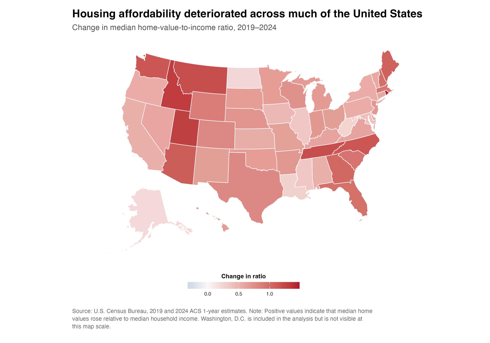
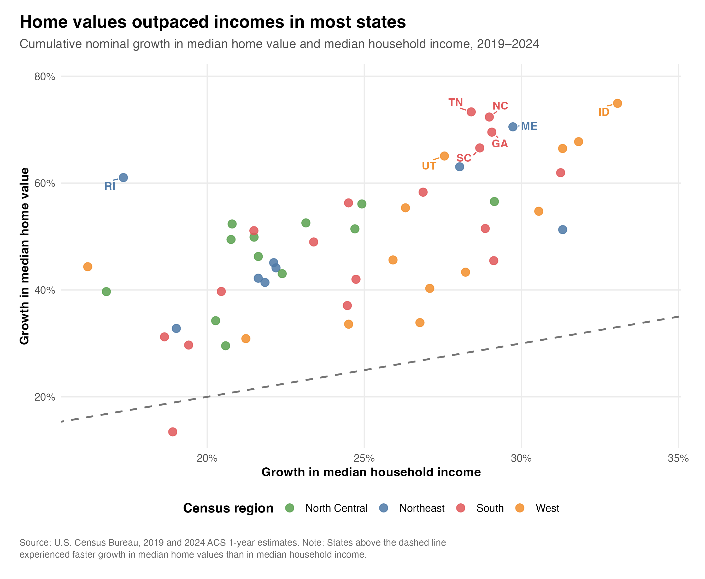

Hello everyone and welcome back! I hope you all had a wonderful fall break! For my fourth blog post, I wanted to look at a question that has become difficult to ignore: how much less affordable has housing become since 2019?

My question is: **how did housing affordability change across U.S. states from 2019 to 2024, and how much did higher mortgage rates add to the pressure?**

A rising home value is not enough to answer this question. A home can become more expensive without becoming less affordable if household income rises at the same pace. Financing conditions also matter because the same loan produces a much larger monthly payment at a higher interest rate.

## Measuring Affordability

I use the U.S. Census Bureau’s [2019 and 2024 American Community Survey](https://www.census.gov/programs-surveys/acs/data.html) one-year estimates for median household income and the median value of owner-occupied housing units. I combine these data with the Freddie Mac 30-year fixed mortgage rate available through [FRED](https://fred.stlouisfed.org/series/MORTGAGE30US).

My first measure is the home-value-to-income ratio. For state $s$ in year $t$, I calculate

$$
R_{s,t}
=
\frac{V_{s,t}}{Y_{s,t}},
$$

where $V_{s,t}$ is median home value and $Y_{s,t}$ is median household income. A higher ratio means that a typical owner-occupied home is more expensive relative to annual income.

I also compare the cumulative growth of home values and income from 2019 to 2024:

$$
g_{X,s}
=
\left(
\frac{X_{s,2024}}{X_{s,2019}}-1
\right)
\times 100.
$$

Finally, I estimate a monthly mortgage payment under a consistent scenario: purchase at the median home value, a 20% down payment, and a 30-year fixed-rate mortgage. The standard fixed-payment formula is

$$
M_{s,t}
=
P_{s,t}
\left[
\frac{r_t(1+r_t)^{360}}
{(1+r_t)^{360}-1}
\right],
$$

where $P_{s,t}$ is 80% of median home value and $r_t$ is the monthly mortgage rate. I then calculate the estimated annual payment burden as

$$
B_{s,t}
=
\frac{12M_{s,t}}{Y_{s,t}}
\times 100.
$$

The complete data download, cleaning, calculations, and visualization code is available in my [GitHub repository](https://github.com/Changlin-DU/dataset_of_choice.git).

## Affordability Worsened Almost Everywhere

{#fig-affordability-map fig-alt="Map of the United States showing the change in each state's median home-value-to-income ratio between 2019 and 2024. Most states show an increase." width="100%"}

@fig-affordability-map shows that the home-value-to-income ratio increased in 50 of the 51 jurisdictions in the analysis. Washington, D.C. was the only exception. Across all states and D.C., the median ratio rose from 3.42 in 2019 to 4.24 in 2024.

This means that in the median state, the value of a typical owner-occupied home increased from about 3.4 years of median household income to more than 4.2 years. The map also shows that the deterioration was not limited to traditionally expensive coastal markets. Several Mountain West and Southern states experienced especially large changes.

## Home Values Moved Faster Than Income

{#fig-growth-comparison fig-alt="Scatterplot comparing growth in median household income with growth in median home values from 2019 to 2024. Nearly every state is above the equal-growth line." width="100%"}

@fig-growth-comparison explains why the ratios increased. The median state-level increase in home values was 49.4%, while the median increase in household income was 24.5%. Home values outpaced income in 50 of 51 jurisdictions.

Rhode Island had the largest increase in its ratio, rising from 3.98 to 5.46. Idaho, Utah, Montana, and Tennessee followed. These are not necessarily the five most expensive places in level terms. Instead, they experienced some of the largest deteriorations relative to their own 2019 income and home-value levels.

## Mortgage Rates Added a Second Affordability Shock

{#fig-mortgage-burden fig-alt="Dumbbell chart comparing estimated mortgage-payment burdens in 2019 and 2024 for the fifteen jurisdictions with the highest 2024 estimates." width="100%"}

@fig-mortgage-burden adds the cost of borrowing. The annual average 30-year mortgage rate increased from 3.94% in 2019 to 6.72% in 2024. When I apply those rates to the same mortgage assumptions, the median estimated payment burden rises from 15.6% to 26.3% of median household income.

The highest 2024 estimate is Hawaii at 54.0%, followed by California at 47.1% and Washington, D.C. at 41.5%. These calculations are intentionally simplified. They exclude property taxes, insurance, maintenance, closing costs, and HOA fees. ACS home values are reported values for existing owner-occupied homes rather than observed purchase prices, while median household income includes both renter and owner households. The measure is therefore best read as a consistent state-level comparison, not as the exact budget of a typical buyer.

This analysis is descriptive. It shows where affordability changed and how the three measures moved together, but it does not identify why particular states experienced larger changes than others.

## Takeaway

Overall, my main takeaway is that the affordability problem between 2019 and 2024 had two parts. Home values rose much faster than household incomes in almost every state, increasing the amount a buyer would need to borrow. At the same time, higher mortgage rates made each borrowed dollar more expensive.

Looking only at home values would miss the role of income, while looking only at mortgage rates would miss how much the underlying value-to-income relationship had already changed. Taken together, the three visualizations show why buying a typical home became substantially harder across most of the country.